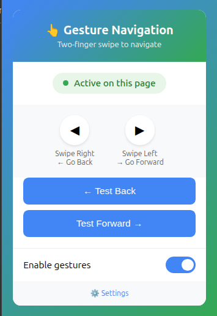

# Two-Finger Gesture Navigation

A Chrome extension that brings macOS-like two-finger swipe navigation to Chrome. Navigate forward and backward through browser history with intuitive trackpad gestures.

## Screenshot



## Features

- **Two-Finger Swipe Gestures** - Swipe with two fingers on your trackpad to navigate
- **Customizable Sensitivity** - Adjust how far you need to swipe to trigger navigation
- **Configurable Settings** - Toggle gestures, reverse direction, change indicator style
- **Visual Indicator** - Optional visual feedback showing gesture direction
- **Smart Detection** - Ignores gestures in text inputs and editable areas
- **Adjustable Cooldown** - Prevent accidental multiple navigations
- **Multiple Indicator Positions** - Choose from 8 different screen positions

## Installation

### From Chrome Web Store (Recommended)

[](https://chromewebstore.google.com/detail/two-finger-gesture-naviga/gkjmhkekgfahedjajjallabnnjpibgdh)

[**Install from Chrome Web Store →**](https://chromewebstore.google.com/detail/two-finger-gesture-naviga/gkjmhkekgfahedjajjallabnnjpibgdh)

### From Source (Developer Mode)

1. Download or clone this repository
2. Open Chrome and navigate to `chrome://extensions/`
3. Enable "Developer mode" in the top right corner
4. Click "Load unpacked"
5. Select the `gesture-nav-extension` folder

## Usage

Once installed:

| Gesture | Action (Default) | Action (Reverse Enabled) |
|---------|------------------|--------------------------|
| Swipe Right | Forward | Back |
| Swipe Left | Back | Forward |

**Note:** Reverse direction is enabled by default to match natural expectations.

## Settings

Click the extension icon to access:
- **Enable/Disable** - Toggle gesture navigation
- **Test Buttons** - Test navigation without gestures
- **Settings** - Open full options page

### Options Page

Access via Settings button or right-click the icon → Options:

#### General Settings
- **Enable Gesture Navigation** - Master toggle for the extension
- **Reverse Direction** - Swap back/forward gestures (enabled by default)

#### Sensitivity
- **Gesture Threshold** (30-300) - How far to swipe before triggering (default: 100)
- **Cooldown** (100-1000ms) - Delay between gestures to prevent accidental triggers (default: 300ms)

#### Visual Indicator
- **Show Indicator** - Display visual feedback on gesture (disabled by default)
- **Indicator Position** - Choose where the indicator appears:
  - Sides (left for back, right for forward)
  - Center
  - Always Left / Always Right
  - Top/Left/Right Corners (4 options)
- **Indicator Color** - Customize the indicator color
- **Indicator Size** (30-120px) - Adjust indicator size

## Known Limitations

### Chrome Internal Pages
This extension **will not work** on Chrome's internal pages, including:
- New Tab page (`chrome://newtab`)
- Settings (`chrome://settings`)
- Extensions page (`chrome://extensions`)
- History page (`chrome://history`)
- Downloads page (`chrome://downloads`)
- Any other `chrome://` URLs

**Why?** Chrome security restrictions prevent extensions from running on internal pages. This is a browser-level limitation that cannot be bypassed.

The extension works perfectly on all regular websites (`https://`, `http://`).

### Navigation Behavior
- `window.history.back()` and `window.history.forward()` are used for navigation
- These rely on the browser's session history
- If no history is available, the gesture won't navigate (this is expected behavior)

## How It Works

The extension monitors horizontal scroll events (`wheel` event with `deltaX`) to detect two-finger swipe gestures on trackpads. When a sufficient horizontal movement is detected within a short time window, it triggers browser navigation.

**Technical Details:**
- Uses the `wheel` event to detect horizontal scroll (`deltaX`)
- Accumulates scroll deltas to determine gesture completion
- Applies cooldown period to prevent accidental triggers
- Filters out gestures from editable elements (inputs, textareas, etc.)

## Compatibility

- **Browsers:** Google Chrome, Chromium-based browsers (Edge, Brave, Opera, etc.)
- **Operating Systems:** macOS, Windows, Linux (any OS with a trackpad supporting horizontal scrolling)
- **Hardware:** Works with any trackpad that supports two-finger horizontal scrolling

## Troubleshooting

### Gestures not working?

1. **Check if extension is enabled** - Click the toolbar icon and verify "Enable gestures" is on
2. **Verify you're on a regular website** - Extension doesn't work on `chrome://` pages
3. **Adjust sensitivity** - Lower the "Gesture Threshold" if swipes aren't detected
4. **Check cooldown** - Make sure you wait between swipes
5. **Not in editable areas** - Gestures are intentionally disabled in text inputs

### Too sensitive?

- Increase the "Gesture Threshold" in settings
- Increase the "Cooldown" period

### Not sensitive enough?

- Decrease the "Gesture Threshold" in settings

## File Structure

```
gesture-nav-extension/
├── manifest.json       # Extension manifest v3
├── background.js       # Service worker
├── content.js         # Gesture detection script (injected into pages)
├── popup.html         # Extension popup UI
├── popup.js           # Popup functionality
├── options.html       # Settings page UI
├── options.js         # Settings functionality
├── icons/             # Extension icons (16, 32, 48, 128px)
└── README.md          # This file
```

## Contributing

Contributions are welcome! Feel free to:
- Report bugs
- Suggest new features
- Submit pull requests
- Improve documentation

## License

MIT License - feel free to modify, distribute, and use in your own projects.

## Credits

Created with ❤️ for the Chrome extension community.

Inspired by macOS's two-finger swipe navigation behavior.

---

**Note:** This is an open-source project. If you find it useful, consider giving it a star on GitHub and sharing it with others!
